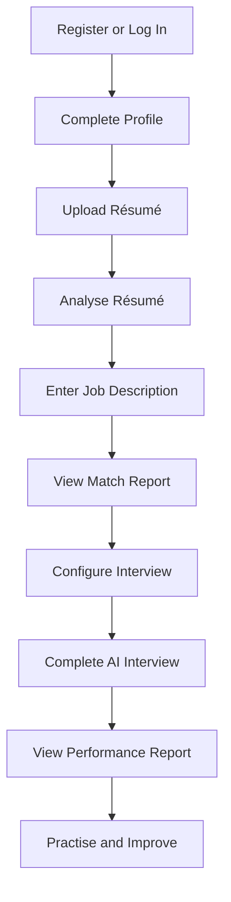

# CareerSaathi AI: Project Documentation

Welcome to the official documentation for CareerSaathi AI.

**Formal Title:** CareerSaathi AI: An Intelligent Résumé Analysis and Mock
Interview Evaluation System
**Version:** 1.0
**Project Type:** AI-Powered Full-Stack Web Application
**Target Completion:** 15 September 2026
**Last Updated:** August 2026

---

## 1. Project Summary

CareerSaathi AI is an intelligent career-preparation platform for students,
fresh graduates, and job seekers.

It combines:

- Résumé analysis
- Job-description matching
- Skill-gap identification
- AI-generated mock interviews
- Text and voice answers
- Dynamic follow-up questions
- Answer evaluation
- Performance reports
- Personalized improvement suggestions
- Candidate progress tracking

The project uses React for the frontend, FastAPI for the backend, PostgreSQL
for the database, and pre-trained AI and speech models for intelligent
features.

---

## 2. Documentation Contents

| Document | Description | Status |
|---|---|---|
| [Project Overview](./project-overview.md) | Introduction, problem, solution, objectives, and scope | Complete |
| [System Requirements](./requirements.md) | Functional and non-functional requirements | Complete |
| [Feature List](./feature-list.md) | MVP, supporting, future, and excluded features | Complete |
| [Technology Stack](./tech-stack.md) | Frontend, backend, database, AI, speech, and testing tools | Complete |
| [Software Architecture](./software-architecture.md) | Application layers, modules, and system communication | Complete |
| [User Flow](./user-flow.md) | Complete candidate journey and decision flows | Complete |
| [Database Design](./database-design.md) | PostgreSQL tables, relationships, constraints, and indexes | Complete |
| [API Documentation](./api-documentation.md) | Planned FastAPI endpoints and response structures | Complete |
| [Project Roadmap](./project-roadmap.md) | Development phases, dates, risks, and milestones | Complete |

---

## 3. Recommended Reading Order

The recommended order for understanding the project is:

1. [Project Overview](./project-overview.md)
2. [System Requirements](./requirements.md)
3. [Feature List](./feature-list.md)
4. [Technology Stack](./tech-stack.md)
5. [Software Architecture](./software-architecture.md)
6. [User Flow](./user-flow.md)
7. [Database Design](./database-design.md)
8. [API Documentation](./api-documentation.md)
9. [Project Roadmap](./project-roadmap.md)

---

## 4. Project Identity

| Item | Value |
|---|---|
| Product name | CareerSaathi AI |
| Formal title | Intelligent Résumé Analysis and Mock Interview Evaluation System |
| Tagline | Your AI Partner from Résumé to Interview |
| Project folder | `CareerSaathi-AI` |
| GitHub repository | `careersaathi-ai` |
| PostgreSQL database | `careersaathi_ai` |
| Database user | `careersaathi_app` |

---

## 5. Core Technology Stack

```text
Frontend:
React.js + Vite + Tailwind CSS

Backend:
Python + FastAPI + Pydantic

Database:
PostgreSQL + SQLAlchemy + Alembic + Psycopg

Authentication:
JWT + HTTP-only Cookies + Argon2

Résumé Processing:
PyMuPDF + python-docx

Artificial Intelligence:
Pre-trained LLM + NLP + Rule-Based Matching

Speech:
MediaRecorder + Whisper + Speech Synthesis

Testing:
Vitest + React Testing Library + Pytest + HTTPX

Version Control:
Git + GitHub
```

MongoDB, Mongoose, Express.js, and a Node.js backend will not be used in this
project.

---

## 6. Main Project Modules

CareerSaathi AI contains the following modules:

1. User authentication
2. Candidate profile
3. Résumé management
4. Résumé analysis
5. Skill extraction
6. Job-description management
7. Résumé-to-job matching
8. Skill-gap analysis
9. Interview configuration
10. AI question generation
11. Text and voice interview
12. Dynamic follow-up questions
13. Answer evaluation
14. Performance reports
15. Dashboard and history

---

## 7. Main User Journey



---

## 8. Development Status

### Phase 1 — Planning and Documentation

- [x] Final project name selected
- [x] Technology stack finalized
- [x] Development tools verified
- [x] PostgreSQL installed
- [x] Project database created
- [x] Application database user created
- [x] Database connection tested
- [x] Local Git repository initialized
- [x] GitHub repository connected
- [x] Project overview completed
- [x] Requirements completed
- [x] Feature list completed
- [x] Technology stack completed
- [x] Software architecture completed
- [x] User flow completed
- [x] Database design completed
- [x] API planning completed
- [x] Project roadmap completed
- [x] Documentation index completed

### Next Phase

Phase 2 will create:

- React and Vite frontend
- Tailwind CSS configuration
- Python virtual environment
- FastAPI backend
- Base folder architectures
- Environment-variable configuration
- Health-check API
- Frontend-to-backend connection

---

## 9. Documentation Standards

All project documentation should:

- Use Markdown format.
- Use clear and simple English.
- Use consistent headings.
- Include the document version.
- Include the last-updated date.
- Use Mermaid for system diagrams.
- Avoid storing passwords or API keys.
- Match the implemented application.
- Be updated whenever important project decisions change.
- End with one newline character.

---

## 10. Security Notice

The following information must never be included in documentation or committed
to GitHub:

- PostgreSQL passwords
- JWT secrets
- AI-provider API keys
- Speech-service API keys
- Production database URLs containing passwords
- Authentication cookies or tokens
- Real candidate résumé information
- Private user information

Example environment-variable names may be documented, but their real values
must remain inside ignored `.env` files.

---

## 11. Documentation Maintenance

Documentation will be reviewed at the end of every major phase.

When the implementation changes:

1. Update the related document.
2. Update the version if necessary.
3. Update the last-modified date.
4. Verify diagrams and links.
5. Commit the documentation change with the related code.

Documentation and implementation must remain consistent.

---

## 12. Final Objective

The final goal is to create a fully working and deployed web application where
a candidate can:

1. Create an account.
2. Manage a candidate profile.
3. Upload and analyse a résumé.
4. Compare the résumé with a job description.
5. Identify matched and missing skills.
6. Attend a personalized AI mock interview.
7. Answer questions through text or voice.
8. Receive dynamic follow-up questions.
9. Receive a detailed performance report.
10. Track progress and improve job readiness.

CareerSaathi AI will provide career-preparation guidance. It will not replace
human recruiters, professional career counsellors, or official hiring
decisions.

---

© 2026 CareerSaathi AI Project Documentation