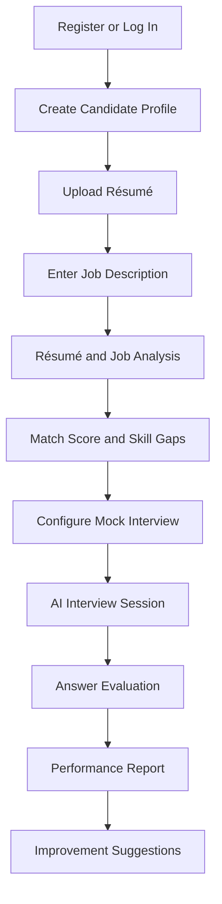

# CareerSaathi AI: Project Overview

**Project Name:** CareerSaathi AI
**Formal Title:** CareerSaathi AI: An Intelligent Résumé Analysis and Mock Interview Evaluation System
**Version:** 1.0
**Project Type:** AI-Powered Full-Stack Web Application
**Last Updated:** August 2026

---

## 1. Introduction

CareerSaathi AI is an intelligent career-preparation platform designed for
students, fresh graduates, and job seekers. It combines résumé analysis,
job-description matching, skill-gap identification, and AI-powered mock
interviews in a single application.

The system helps candidates understand whether their résumé matches a selected
job role. It also conducts personalized mock interviews based on the
candidate's résumé, skills, experience level, and target job.

After completing an interview, the candidate receives a detailed performance
report containing scores, strengths, weaknesses, and personalized improvement
suggestions.

---

## 2. Problem Statement

Students and job seekers often face difficulty in preparing effective résumés
and practising job interviews. Many candidates do not know whether their
résumé contains the skills and keywords required for a particular job.

Traditional mock interviews normally require a human interviewer. This limits
how frequently candidates can practise and may result in inconsistent
feedback. Existing interview-practice applications may use fixed questions
and provide only basic evaluation.

An intelligent and accessible system is therefore required to analyse résumés,
compare candidate skills with job requirements, conduct dynamic mock
interviews, and generate personalized feedback.

---

## 3. Proposed Solution

CareerSaathi AI provides a complete career-readiness workflow. Candidates can
upload their résumé in PDF or DOCX format and provide a target job description.

The system extracts important information such as skills, education,
experience, projects, and certifications. It then compares the extracted
information with the job description and produces a match score, missing-skill
report, and résumé improvement suggestions.

The candidate can start a mock interview by selecting a job role, interview
type, difficulty level, and experience level. The AI generates questions and
dynamic follow-up questions based on the candidate's previous answers.

Answers can be submitted through text or voice. Voice answers are converted
into text before evaluation. At the end of the interview, the system generates
a performance report with category scores and improvement suggestions.

---

## 4. Project Objectives

The main objectives of CareerSaathi AI are:

- Analyse résumés using NLP and AI.
- Extract candidate skills, education, projects, and experience.
- Compare résumés with job descriptions.
- Calculate a résumé-to-job match score.
- Identify missing skills and important keywords.
- Generate personalized résumé improvement suggestions.
- Conduct role-based AI mock interviews.
- Support text and voice-based interview answers.
- Generate dynamic follow-up questions.
- Evaluate technical knowledge and answer relevance.
- Analyse communication quality and response structure.
- Generate detailed performance reports.
- Store résumé analyses and interview history.
- Provide personalized career-preparation guidance.

---

## 5. Target Users

CareerSaathi AI is primarily designed for:

- College students
- Fresh graduates
- Internship applicants
- Job seekers
- Candidates preparing for technical interviews
- Candidates preparing for HR interviews
- Training and placement students

---

## 6. Main System Modules

The project contains the following main modules:

1. User registration and authentication
2. Candidate profile management
3. Résumé upload and management
4. Résumé text extraction
5. Skill and experience extraction
6. Job-description analysis
7. Résumé-to-job matching
8. Skill-gap identification
9. Interview configuration
10. AI question generation
11. Voice and text interview
12. Dynamic follow-up questions
13. Answer evaluation
14. Performance scoring
15. Personalized feedback
16. Candidate dashboard
17. Interview and analysis history

---

## 7. Basic System Flow

---

## 8. Project Scope

### Included in the Initial Version

- User authentication
- Candidate profiles
- PDF and DOCX résumé uploads
- Résumé text extraction
- Skill extraction
- Job-description matching
- Match-score calculation
- Missing-skill analysis
- AI-generated questions
- Technical and HR interviews
- Text and voice answers
- Speech-to-text conversion
- Dynamic follow-up questions
- Answer evaluation
- Performance reports
- Interview history
- Responsive web interface

### Planned for Future Versions

- AI interviewer avatar
- Facial-expression analysis
- Multilingual interviews
- Company-specific interview simulations
- Live coding interviews
- Real-time pronunciation feedback
- Video interview recording
- Recruiter and placement-officer dashboard
- Job recommendations
- Mobile application

---

## 9. Technology Summary

CareerSaathi AI will use **React.js** and **Tailwind CSS** for the frontend.
**Python** and **FastAPI** will manage the backend APIs, business logic, AI
integration, and speech processing.

**PostgreSQL** will store users, résumés, job descriptions, interview sessions,
answers, evaluations, and reports. **SQLAlchemy** will provide database access,
while **Alembic** will manage database migrations.

LLMs and NLP techniques will be used for résumé analysis, question generation,
answer evaluation, and personalized feedback. **Whisper** will convert recorded
speech into text.

---

## 10. Expected Outcome

The final result will be a fully working and deployed web application where a
candidate can analyse a résumé, compare it with a job description, practise a
personalized AI interview, and receive a detailed performance report.

CareerSaathi AI will act as an intelligent career companion that helps users
improve their résumés, skills, interview answers, and overall job readiness.

The system will provide guidance and practice support. Its AI-generated scores
and suggestions will not replace decisions made by human recruiters or
professional career counsellors.

---

© 2026 CareerSaathi AI Project Documentation