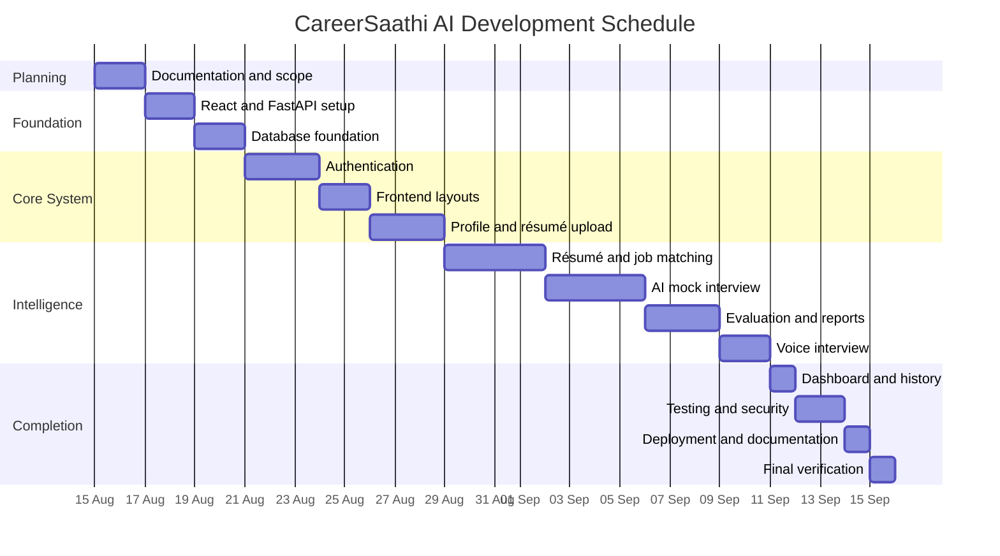

# CareerSaathi AI: Project Roadmap

**Version:** 1.0
**Document:** Development Roadmap
**Project Start:** 15 August 2026
**Target Completion:** 15 September 2026
**Last Updated:** August 2026

---

## 1. Overview

This document defines the planned development schedule for CareerSaathi AI,
from project planning to final deployment.

The goal is to build a complete MVP containing résumé analysis, job matching,
AI mock interviews, voice support, answer evaluation, performance reports, and
a candidate dashboard.

The project must remain focused on the finalized MVP features to meet the
target date of 15 September 2026.

---

## 2. Development Strategy

CareerSaathi AI will be developed using the following approach:

1. Complete planning and documentation.
2. Create the React and FastAPI foundations.
3. Connect FastAPI with PostgreSQL.
4. Implement authentication.
5. Build the candidate profile.
6. Implement résumé upload and processing.
7. Build job-description matching.
8. Develop the text-based AI interview.
9. Add answer evaluation and reports.
10. Add voice recording and transcription.
11. Complete the dashboard and history.
12. Test, secure, deploy, and demonstrate the application.

Each phase will be tested before moving to the next phase.

---

## 3. Project Timeline

| Phase | Date | Main Deliverable |
|---|---|---|
| Phase 1 | 15–16 August | Planning and documentation |
| Phase 2 | 17–18 August | React and FastAPI foundations |
| Phase 3 | 19–20 August | PostgreSQL and backend structure |
| Phase 4 | 21–23 August | Authentication system |
| Phase 5 | 24–25 August | Frontend foundation and layouts |
| Phase 6 | 26–28 August | Candidate profile and résumé upload |
| Phase 7 | 29 August–1 September | Résumé analysis and job matching |
| Phase 8 | 2–5 September | AI mock interview system |
| Phase 9 | 6–8 September | Evaluation and performance reports |
| Phase 10 | 9–10 September | Voice interview support |
| Phase 11 | 11 September | Dashboard and history |
| Phase 12 | 12–13 September | Testing and security review |
| Phase 13 | 14 September | Deployment and final documentation |
| Phase 14 | 15 September | Final verification and demonstration |

---

## 4. Visual Schedule



---

## 5. Phase 1 — Planning and Documentation

**Planned dates:** 15–16 August 2026

### Tasks

- Finalize the project name.
- Confirm the problem statement.
- Confirm project objectives.
- Finalize MVP features.
- Finalize the technology stack.
- Install and verify development tools.
- Install PostgreSQL.
- Create the application database.
- Create the GitHub repository.
- Prepare the project folder structure.
- Write the project overview.
- Write system requirements.
- Write the feature list.
- Document the technology stack.
- Design the software architecture.
- Document the user flow.
- Design the PostgreSQL database.
- Plan the REST APIs.
- Prepare the project roadmap.

### Completion Result

The project scope, architecture, technologies, database, APIs, and development
schedule will be clearly documented.

---

## 6. Phase 2 — Frontend and Backend Foundations

**Planned dates:** 17–18 August 2026

### Frontend Tasks

- Create the React application using Vite.
- Install required frontend packages.
- Configure Tailwind CSS.
- Clean the default Vite application.
- Create the frontend folder structure.
- Configure React Router.
- Add global styles and design tokens.
- Create the initial application route.

### Backend Tasks

- Create a Python virtual environment.
- Create the FastAPI application.
- Install backend dependencies.
- Create the backend folder structure.
- Configure environment variables.
- Create the API version structure.
- Add the health-check endpoint.
- Configure CORS.
- Add centralized error handling.
- Start and test the Uvicorn server.

### Completion Result

React and FastAPI will run independently and the frontend will successfully
call the backend health endpoint.

---

## 7. Phase 3 — PostgreSQL and Backend Database Foundation

**Planned dates:** 19–20 August 2026

### Tasks

- Install SQLAlchemy.
- Install Psycopg.
- Install and initialize Alembic.
- Configure the database URL.
- Create the database session.
- Create the SQLAlchemy base model.
- Add shared timestamp fields.
- Test the PostgreSQL connection.
- Create the first migration.
- Apply the migration.
- Add database connection tests.

### Completion Result

FastAPI will connect securely to the `careersaathi_ai` PostgreSQL database, and
Alembic will manage database changes.

---

## 8. Phase 4 — Authentication System

**Planned dates:** 21–23 August 2026

### Backend Tasks

- Create the User model.
- Create registration schemas.
- Create login schemas.
- Add Argon2 password hashing.
- Add JWT token generation.
- Configure HTTP-only cookies.
- Create registration endpoint.
- Create login endpoint.
- Create current-user endpoint.
- Create logout endpoint.
- Add authentication middleware or dependencies.
- Add authentication tests.

### Frontend Tasks

- Create authentication layout.
- Create registration form.
- Create login form.
- Add form validation.
- Connect forms to the backend.
- Create authentication context.
- Add protected routes.
- Add logout.
- Test session persistence.

### Completion Result

Candidates will be able to register, log in, stay authenticated, access
protected pages, and log out securely.

---

## 9. Phase 5 — Frontend Foundation

**Planned dates:** 24–25 August 2026

### Tasks

- Create the main layout.
- Create the authentication layout.
- Build the navigation bar.
- Build the footer.
- Create the landing page.
- Create the dashboard shell.
- Add responsive navigation.
- Create reusable buttons.
- Create reusable form controls.
- Create cards, loaders, alerts, and empty states.
- Add the not-found page.
- Test desktop and mobile layouts.

### Completion Result

CareerSaathi AI will have a complete responsive frontend foundation and
consistent design system.

---

## 10. Phase 6 — Candidate Profile and Résumé Management

**Planned dates:** 26–28 August 2026

### Candidate Profile Tasks

- Create the CandidateProfile model.
- Build profile APIs.
- Create the profile page.
- Add profile editing.
- Add candidate skill management.
- Add profile validation.
- Test profile ownership.

### Résumé Tasks

- Create résumé database models.
- Build PDF and DOCX upload APIs.
- Add file validation.
- Store résumé metadata.
- Build the résumé-management page.
- Add primary résumé selection.
- Add résumé deletion.
- Test file ownership and security.

### Completion Result

Candidates will be able to manage profiles and upload secure PDF or DOCX
résumés.

---

## 11. Phase 7 — Résumé Intelligence and Job Matching

**Planned dates:** 29 August–1 September 2026

### Résumé Analysis Tasks

- Extract PDF text using PyMuPDF.
- Extract DOCX text using python-docx.
- Clean extracted text.
- Identify résumé sections.
- Extract candidate skills.
- Extract education and experience.
- Store analysis results.
- Display the analysis report.

### Job-Matching Tasks

- Create job-description models and APIs.
- Extract required job skills.
- Normalize skill names.
- Compare résumé and job skills.
- Calculate category scores.
- Calculate the overall match score.
- Identify missing skills.
- Generate improvement suggestions.
- Save and display job-match reports.
- Test matching calculations.

### Completion Result

Candidates will be able to analyse a résumé and compare it with a target job
description.

---

## 12. Phase 8 — AI Mock Interview System

**Planned dates:** 2–5 September 2026

### Tasks

- Create interview database models.
- Build the interview-configuration page.
- Build interview-session APIs.
- Create the AI-provider interface.
- Design question-generation prompts.
- Generate role-based questions.
- Generate résumé-based questions.
- Generate job-description-based questions.
- Display one question at a time.
- Record response time.
- Accept typed answers.
- Generate dynamic follow-up questions.
- Save questions and answers.
- Handle interrupted sessions.
- Test the complete text interview.

### Completion Result

Candidates will be able to complete personalized text-based AI mock
interviews.

---

## 13. Phase 9 — Answer Evaluation and Reports

**Planned dates:** 6–8 September 2026

### Tasks

- Define answer-evaluation criteria.
- Design structured evaluation prompts.
- Validate AI evaluation responses.
- Calculate question-level scores.
- Generate written answer feedback.
- Calculate category scores.
- Calculate the overall interview score.
- Identify strengths and weaknesses.
- Generate personalized suggestions.
- Create the performance-report page.
- Save reports in PostgreSQL.
- Test scoring boundaries and failures.

### Completion Result

Every completed interview will generate a structured and understandable
performance report.

---

## 14. Phase 10 — Voice Interview Support

**Planned dates:** 9–10 September 2026

### Tasks

- Request microphone permission.
- Record audio using MediaRecorder.
- Create an audio-upload endpoint.
- Validate audio files.
- Connect Whisper transcription.
- Display the generated transcript.
- Allow transcript review.
- Submit the transcript for evaluation.
- Add browser text-to-speech.
- Add retry and text-mode fallback.
- Delete temporary audio when appropriate.
- Test microphone-denied situations.
- Test noisy or failed recordings.

### Completion Result

Candidates will be able to hear questions and answer them using their voice.

---

## 15. Phase 11 — Dashboard and History

**Planned date:** 11 September 2026

### Tasks

- Connect dashboard summary data.
- Display profile completion.
- Display latest résumé analysis.
- Display recent job matches.
- Display completed interview count.
- Display latest performance score.
- Create interview-history page.
- Create report-history page.
- Add performance charts.
- Add empty and loading states.

### Completion Result

Candidates will be able to review their activities, results, and progress from
one dashboard.

---

## 16. Phase 12 — Testing and Security Review

**Planned dates:** 12–13 September 2026

### Testing Tasks

- Test all backend endpoints.
- Test database relationships.
- Test authentication and authorization.
- Test résumé file validation.
- Test job-match calculations.
- Test complete interview sessions.
- Test AI-service failures.
- Test speech-service failures.
- Test responsive frontend layouts.
- Test protected routes.
- Run frontend linting.
- Run backend linting.
- Run frontend production build.
- Run backend tests.

### Security Tasks

- Confirm `.env` files are ignored.
- Check GitHub for exposed secrets.
- Validate CORS settings.
- Validate cookie settings.
- Validate record ownership.
- Add rate limiting.
- Review upload security.
- Check error responses.
- Review production environment variables.

### Completion Result

The system will be stable, secure, responsive, and ready for deployment.

---

## 17. Phase 13 — Deployment and Documentation

**Planned date:** 14 September 2026

### Tasks

- Create a managed PostgreSQL database.
- Deploy the FastAPI backend.
- Apply production migrations.
- Configure backend environment variables.
- Deploy the React frontend.
- Configure the production API URL.
- Configure CORS and cookies.
- Configure production file storage.
- Test the deployed application.
- Update the root README.
- Update API and deployment documentation.
- Prepare college proposal material.

### Completion Result

CareerSaathi AI will be publicly accessible through a working deployment.

---

## 18. Phase 14 — Final Verification and Demonstration

**Planned date:** 15 September 2026

### Tasks

- Test registration on the deployed website.
- Test login and logout.
- Test résumé upload.
- Test résumé analysis.
- Test job matching.
- Complete a text interview.
- Complete a voice interview.
- Verify the performance report.
- Test the application on another device.
- Test mobile responsiveness.
- Verify GitHub contains the latest code.
- Verify no secrets are exposed.
- Prepare demonstration data.
- Prepare screenshots and presentation points.
- Create the final project backup.

### Completion Result

The project will be ready for college evaluation, demonstration, and final
submission.

---

## 19. Important Milestones

| Milestone | Target Date |
|---|---|
| Planning complete | 16 August |
| Application foundation complete | 20 August |
| Authentication complete | 23 August |
| Profile and résumé upload complete | 28 August |
| Résumé and job matching complete | 1 September |
| Text interview complete | 5 September |
| Evaluation and reports complete | 8 September |
| Voice interview complete | 10 September |
| Testing complete | 13 September |
| Deployment complete | 14 September |
| Final project ready | 15 September |

---

## 20. Time Requirement

This schedule is intensive and requires regular daily development.

Recommended daily commitment:

```text
Minimum focused work: 5–6 hours per day
Testing and documentation: 1–2 additional hours when required
```

If less time is available, the following features must remain the highest
priority:

1. Authentication
2. Résumé upload and text extraction
3. Job-description matching
4. Text-based mock interview
5. Answer evaluation
6. Performance report
7. Deployment

Voice support should be implemented after the complete text-based interview
works correctly.

---

## 21. Risk Management

| Risk | Effect | Mitigation |
|---|---|---|
| AI API failure | Questions or evaluation unavailable | Add safe retry and error handling |
| AI API cost | Limited testing | Use efficient prompts and model limits |
| Poor résumé extraction | Incomplete analysis | Validate text and show readable errors |
| Speech inaccuracy | Incorrect transcript | Allow transcript review and text fallback |
| Deployment failure | Application unavailable | Deploy before the final day |
| Cookie or CORS issue | Login fails in production | Test frontend and backend domains early |
| Scope expansion | Deadline missed | Keep future features outside MVP |
| Database migration error | Data or deployment failure | Review migrations and maintain backups |
| Secret exposure | Security problem | Use `.env` and check GitHub |
| Limited testing time | Hidden bugs | Test every phase immediately |

---

## 22. Git Workflow

Development will follow this workflow:

```text
Check Git Status
      ↓
Create or Select Feature Branch
      ↓
Implement a Small Task
      ↓
Test the Task
      ↓
Run Linting
      ↓
Commit with a Clear Message
      ↓
Push to GitHub
      ↓
Merge after Verification
```

Example branch names:

```text
feature/backend-foundation
feature/authentication
feature/resume-upload
feature/job-matching
feature/ai-interview
feature/voice-interview
feature/performance-reports
```

Example commit messages:

```text
chore: initialize CareerSaathi AI project
docs: add phase one project documentation
feat: create FastAPI health endpoint
feat: add PostgreSQL database connection
feat: implement candidate authentication
feat: add resume upload and validation
feat: implement job matching
feat: add AI interview sessions
test: add authentication API tests
fix: handle failed speech transcription
```

---

## 23. Definition of Done

CareerSaathi AI will be considered complete when:

- All MVP features work correctly.
- React communicates successfully with FastAPI.
- FastAPI connects successfully to PostgreSQL.
- Authentication and protected routes work.
- Résumé upload and analysis work.
- Job-description matching works.
- Text-based mock interviews work.
- Voice transcription works.
- Dynamic follow-up questions work.
- Answer evaluation works.
- Final reports are generated and saved.
- Dashboard and history work.
- Automated tests pass.
- Linting passes.
- The frontend production build succeeds.
- The application is deployed.
- The deployed application works on another device.
- GitHub contains the complete source code.
- No passwords or API keys are committed.
- Project documentation is complete.

---

## 24. Roadmap Summary

```text
Planning
   ↓
Application Foundation
   ↓
Database and Authentication
   ↓
Profile and Résumé Management
   ↓
Résumé Intelligence and Job Matching
   ↓
AI Mock Interview
   ↓
Evaluation and Reports
   ↓
Voice Support
   ↓
Dashboard and History
   ↓
Testing and Security
   ↓
Deployment
   ↓
Final Demonstration
```

Following this roadmap will produce a complete and deployable MVP of
CareerSaathi AI by the planned completion date.

---

© 2026 CareerSaathi AI Project Documentation