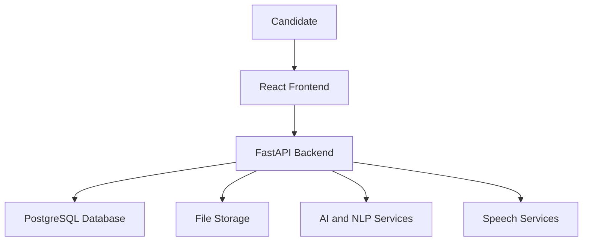
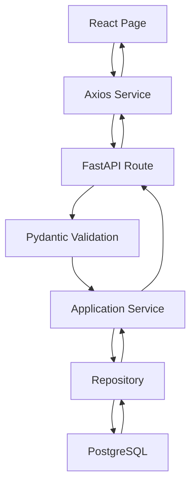
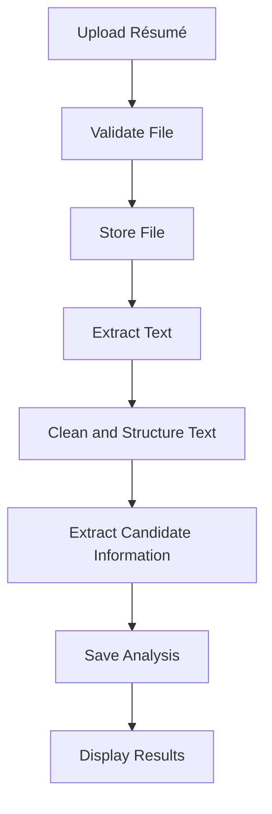
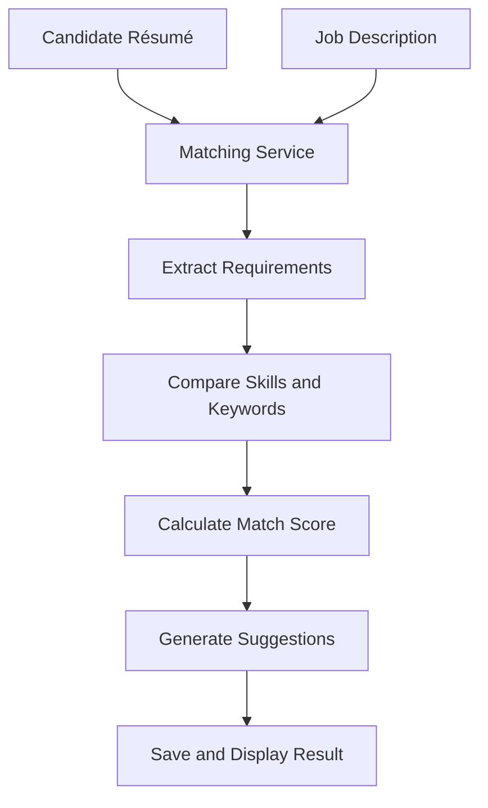
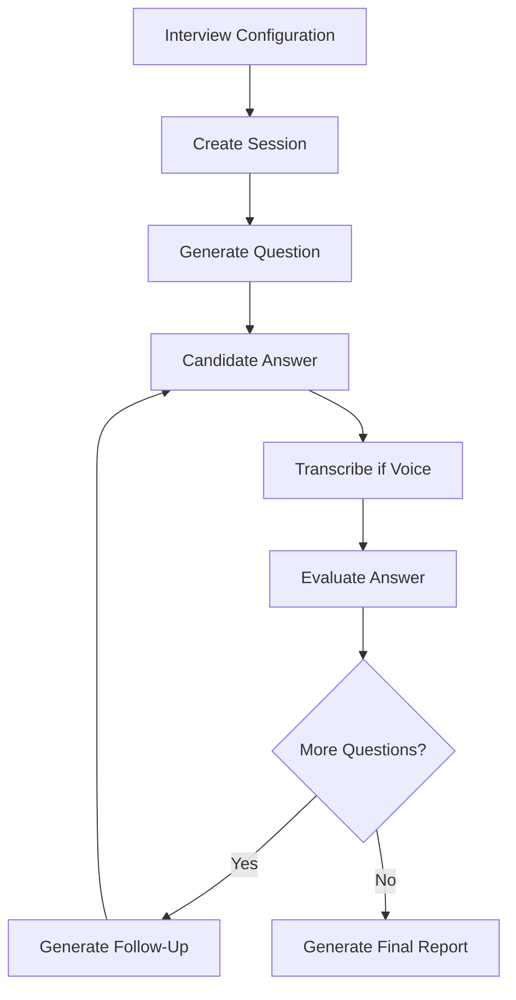
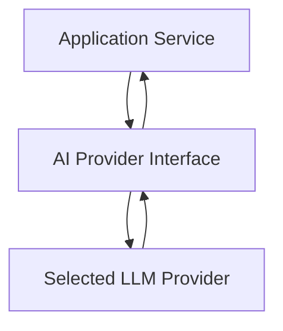
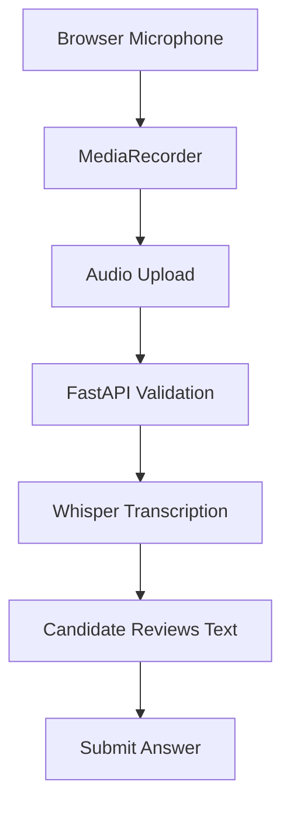
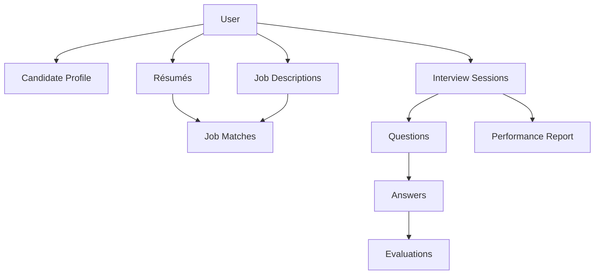
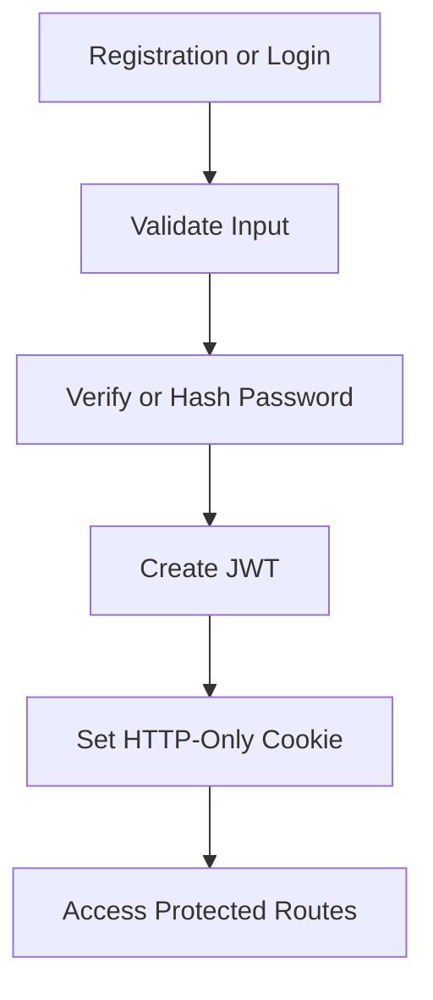
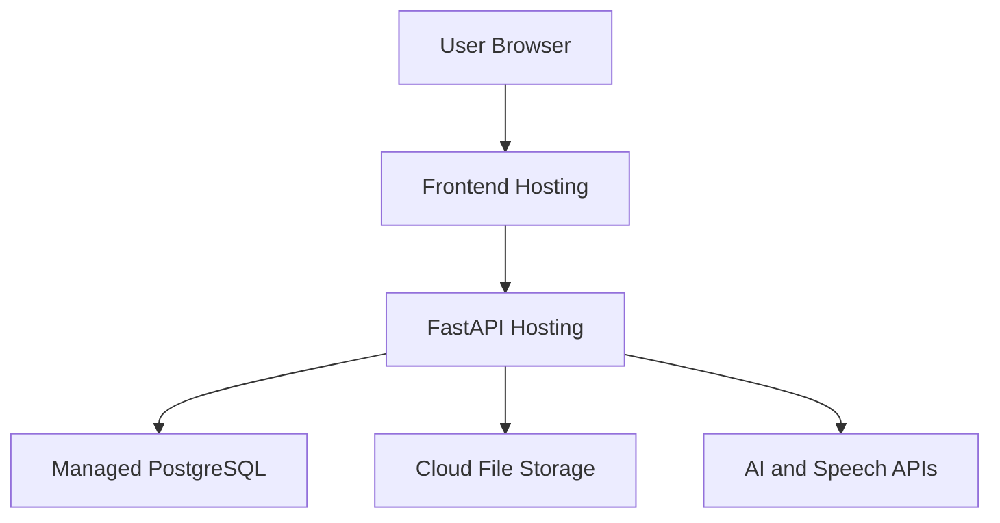

# CareerSaathi AI: Software Architecture

**Version:** 1.0
**Document:** Software Architecture
**Last Updated:** August 2026

---

## 1. Overview

This document describes the software architecture of CareerSaathi AI. It
explains how the frontend, backend, database, résumé-processing services,
artificial intelligence services, and speech services will communicate.

CareerSaathi AI will use a layered client-server architecture. The React
frontend will provide the user interface, while the FastAPI backend will
control application logic, security, database operations, file processing,
and AI communication.

---

## 2. Architecture Goals

The architecture is designed to provide:

- Clear separation between frontend and backend
- Secure handling of user data
- Modular application development
- Easy testing and maintenance
- Replaceable AI providers
- Reliable database operations
- Support for future features
- Simple local development
- Production deployment support

---

## 3. High-Level Architecture



The candidate interacts only with the React frontend. The frontend sends
requests to the FastAPI backend.

The frontend will not connect directly to PostgreSQL, the AI provider, or file
storage.

---

## 4. Main Architecture Layers

CareerSaathi AI will contain four main layers.

### 4.1 Presentation Layer

The presentation layer will be developed using React.js, Vite, and Tailwind
CSS.

Its responsibilities include:

- Displaying pages and components
- Collecting user input
- Showing validation messages
- Uploading résumé files
- Recording voice answers
- Displaying interview questions
- Showing scores and reports
- Managing frontend navigation
- Sending API requests

### 4.2 API and Application Layer

The application layer will be developed using Python and FastAPI.

Its responsibilities include:

- Receiving frontend requests
- Validating request data
- Authenticating users
- Applying business rules
- Controlling interview sessions
- Coordinating AI operations
- Processing résumé files
- Generating API responses
- Handling application errors

### 4.3 Service Layer

The service layer will contain reusable application logic.

Major services will include:

- Authentication service
- Candidate-profile service
- Résumé-processing service
- Skill-extraction service
- Job-matching service
- Interview service
- AI-provider service
- Speech-to-text service
- Answer-evaluation service
- Report-generation service
- File-storage service

### 4.4 Data Layer

The data layer will use PostgreSQL, SQLAlchemy, Alembic, and Psycopg.

Its responsibilities include:

- Storing application data
- Creating database relationships
- Reading and updating records
- Managing database transactions
- Applying database migrations
- Enforcing ownership and integrity rules

---

## 5. Frontend Architecture

The React application will use a feature-based and reusable component
structure.

Planned frontend structure:

```text
client/
├── public/
├── src/
│   ├── assets/
│   ├── components/
│   ├── features/
│   │   ├── auth/
│   │   ├── profile/
│   │   ├── resumes/
│   │   ├── jobMatch/
│   │   ├── interviews/
│   │   └── reports/
│   ├── hooks/
│   ├── layouts/
│   ├── pages/
│   ├── routes/
│   ├── services/
│   ├── styles/
│   ├── utils/
│   ├── App.jsx
│   └── main.jsx
├── .env.example
├── package.json
└── vite.config.js
```

### Frontend Responsibilities

- `components` will contain reusable interface elements.
- `features` will contain code connected to specific project modules.
- `hooks` will contain reusable React logic.
- `layouts` will contain the main and authentication layouts.
- `pages` will contain complete application pages.
- `routes` will define public and protected routes.
- `services` will communicate with backend APIs.
- `styles` will contain shared styles and design tokens.
- `utils` will contain small reusable helper functions.

---

## 6. Backend Architecture

The FastAPI backend will use a modular layered structure.

Planned backend structure:

```text
server/
├── app/
│   ├── api/
│   │   └── routes/
│   ├── core/
│   ├── db/
│   ├── middleware/
│   ├── models/
│   ├── repositories/
│   ├── schemas/
│   ├── services/
│   ├── utils/
│   └── main.py
├── alembic/
├── tests/
├── uploads/
├── .env.example
├── alembic.ini
├── pyproject.toml
└── requirements.txt
```

### Backend Folder Responsibilities

| Folder | Responsibility |
|---|---|
| `api/routes` | FastAPI route definitions |
| `core` | Configuration, security, and settings |
| `db` | Database connection and session management |
| `middleware` | Request processing and error handling |
| `models` | SQLAlchemy database models |
| `repositories` | Database query operations |
| `schemas` | Pydantic request and response models |
| `services` | Business, AI, résumé, and interview logic |
| `utils` | Shared helper functions |
| `tests` | Backend automated tests |
| `alembic` | Database migration files |

---

## 7. Request and Response Flow

A normal API request will follow this sequence:



The route will not contain complex business logic. It will pass validated data
to the correct service.

The service will apply business rules and use a repository when database
access is required.

---

## 8. Résumé-Analysis Architecture

The résumé-analysis flow will be:



### Résumé Processing Steps

1. Verify the authenticated user.
2. Validate the file extension, MIME type, and file size.
3. Store the file using a safe generated filename.
4. Extract text using PyMuPDF or python-docx.
5. Clean unnecessary spaces and formatting.
6. Identify skills, education, experience, projects, and certifications.
7. Store structured results in PostgreSQL.
8. Return the analysis to the frontend.

---

## 9. Job-Matching Architecture

The job-matching flow will be:



The match score will combine explainable rule-based comparison with AI-assisted
analysis.

The result will contain:

- Matched skills
- Missing skills
- Partially matched skills
- Important keywords
- Overall match score
- Improvement suggestions

---

## 10. AI Interview Architecture

The AI interview will use a session-based workflow.



Each interview session will store:

- Candidate
- Résumé
- Job description
- Interview type
- Difficulty level
- Question count
- Questions
- Answers
- Response times
- Evaluations
- Session status
- Final report

---

## 11. AI Service Architecture

The backend will use an AI-provider abstraction layer.



The rest of the application will communicate with the AI-provider interface
instead of directly calling one specific AI company.

This design will allow the project to:

- Change the AI model later
- Use different models for different tasks
- Mock AI responses during testing
- Handle provider errors consistently
- Control prompts in one location
- Validate structured AI responses

AI responses will be validated before being saved or returned to the frontend.

---

## 12. Speech Architecture

The speech-processing flow will be:



Interview questions may be spoken using the browser Speech Synthesis API.

The initial version will not use voice data to predict personality, emotions,
gender, age, or protected personal characteristics.

---

## 13. Database Architecture

PostgreSQL will store structured application records.

Main relationships include:



SQLAlchemy models will represent database tables. Alembic migrations will
create and update the database structure.

Foreign-key relationships and ownership checks will ensure that records remain
connected to the correct candidate.

---

## 14. Authentication Architecture

The authentication flow will be:



Security rules include:

- Passwords will be hashed with Argon2.
- Plain-text passwords will not be stored.
- JWTs will use an application secret.
- Authentication cookies will be HTTP-only.
- Production cookies will use secure settings.
- Protected endpoints will verify the current user.
- Database queries will enforce record ownership.
- Logout will remove the authentication cookie.

---

## 15. Error-Handling Architecture

The backend will use centralized error handling.

The system will handle:

- Invalid request data
- Authentication failure
- Permission failure
- Missing database records
- Duplicate email addresses
- Unsupported files
- Oversized files
- Unreadable résumés
- Database connection errors
- AI-provider errors
- Speech-transcription errors
- Unexpected server errors

API errors will return a consistent response structure:

```json
{
  "success": false,
  "message": "Understandable error message",
  "errors": []
}
```

Sensitive technical details, passwords, tokens, and API keys will not be
included in error responses.

---

## 16. File-Storage Architecture

During local development, files will be stored inside a protected upload
directory.

The database will store:

- Original filename
- Generated storage filename
- File type
- File size
- Storage location
- Owner ID
- Upload date

During deployment, the storage service can be changed to secure cloud object
storage without changing the résumé and interview services.

---

## 17. Deployment Architecture

The production architecture will follow this structure:



The frontend and backend will use separate environment configurations.

Production secrets will be stored in the hosting provider's secure environment
settings and will not be committed to GitHub.

---

## 18. Reliability and Failure Handling

The system will provide:

- Loading indicators during long operations
- Timeouts for external API requests
- Safe retry options
- Database transaction rollback
- Clear error messages
- AI-response validation
- File-processing failure handling
- Recovery from interrupted interview requests
- Logging without sensitive information

If an AI request fails, the application will keep the interview session in a
recoverable state instead of losing all previous answers.

---

## 19. Scalability

The architecture will support future expansion through:

- Modular frontend features
- Independent backend services
- Replaceable AI providers
- Database indexing
- Pagination
- Background processing
- Cloud file storage
- Optional caching
- Optional task queues
- Optional WebSocket communication
- Multiple interview languages
- Additional job roles and evaluation criteria

Background task processing and caching will only be added when required.

---

## 20. Main Architecture Decisions

| Decision | Reason |
|---|---|
| React frontend | Reusable and interactive user interface |
| FastAPI backend | Strong Python, API, AI, and validation support |
| PostgreSQL database | Suitable for connected and structured records |
| SQLAlchemy | Reliable Python database abstraction |
| Alembic | Controlled database migrations |
| REST APIs first | Simpler development and testing |
| AI-provider abstraction | Allows model replacement |
| Pre-trained AI models | Reduces training time and infrastructure |
| HTTP-only cookies | Safer authentication-token storage |
| Modular services | Easier maintenance and testing |
| Cloud storage for deployment | Safer and more reliable file handling |

---

## 21. Architecture Summary

CareerSaathi AI will use a secure, modular, and maintainable architecture.

```text
Candidate
    ↓
React Frontend
    ↓
FastAPI Backend
    ├── Authentication Services
    ├── Résumé Processing Services
    ├── Job-Matching Services
    ├── Interview Services
    ├── AI and NLP Services
    ├── Speech Services
    ├── Report Services
    └── Database Repositories
            ↓
        PostgreSQL
```

This architecture supports the initial project requirements while allowing
future features to be added without rebuilding the complete application.

---

© 2026 CareerSaathi AI Project Documentation