# CareerSaathi AI: User Flow

**Version:** 1.0
**Document:** User Flow
**Last Updated:** August 2026

---

## 1. Overview

This document describes how users will interact with CareerSaathi AI. It
covers registration, profile creation, résumé analysis, job matching, mock
interviews, performance reports, and interview history.

The primary user of the initial version is a candidate preparing for jobs,
internships, technical interviews, or HR interviews.

---

## 2. Main User

### Candidate

A candidate can:

- Create an account
- Log in securely
- Create a candidate profile
- Upload a résumé
- Analyse résumé content
- Enter a target job description
- View match scores and skill gaps
- Configure a mock interview
- Answer through text or voice
- Receive AI-generated follow-up questions
- View a performance report
- Review previous analyses and interviews
- Log out securely

An administrator dashboard may be added in a future version.

---

## 3. Main Entry Flow

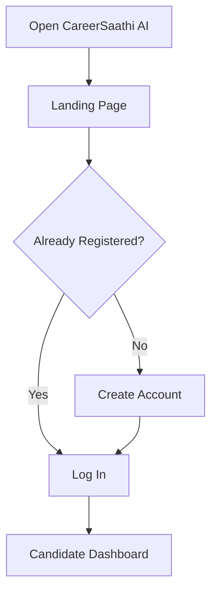

A visitor can view the public landing page. Authentication will be required
before accessing personal résumés, interview sessions, and reports.

---

## 4. Primary Candidate Journey

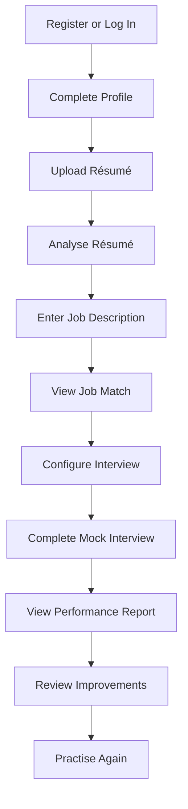

This represents the main end-to-end journey of CareerSaathi AI.

---

## 5. Registration Flow

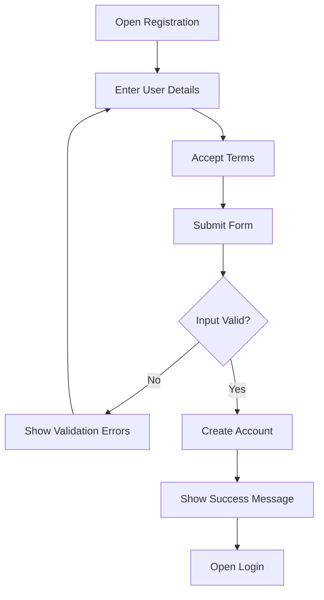

### Registration Information

The registration form will collect:

- Full name
- Email address
- Password
- Password confirmation
- Acceptance of terms

The system will check:

- Required fields
- Valid email format
- Unique email address
- Minimum password strength
- Matching passwords
- Acceptance of terms

---

## 6. Login Flow

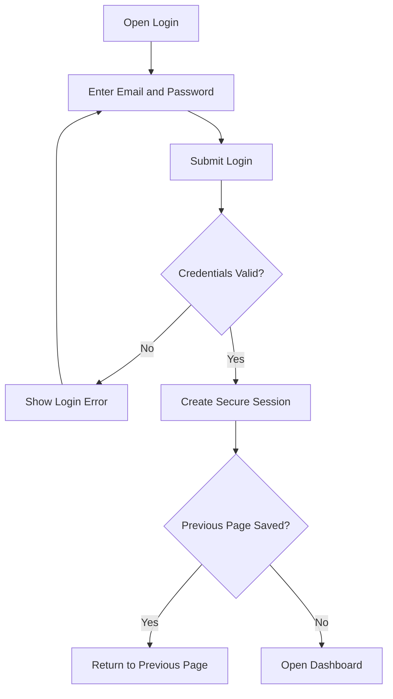

After successful login, the backend will place the authentication token in a
secure HTTP-only cookie.

---

## 7. Candidate Profile Flow

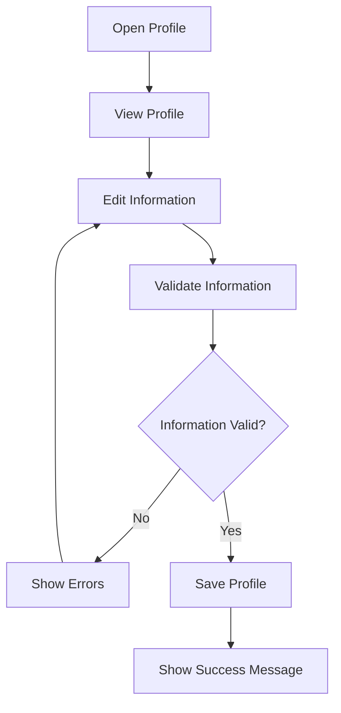

The candidate profile may contain:

- Full name
- Education
- Experience level
- Technical skills
- Preferred job role
- Career objective
- Profile completion status

---

## 8. Résumé Upload Flow

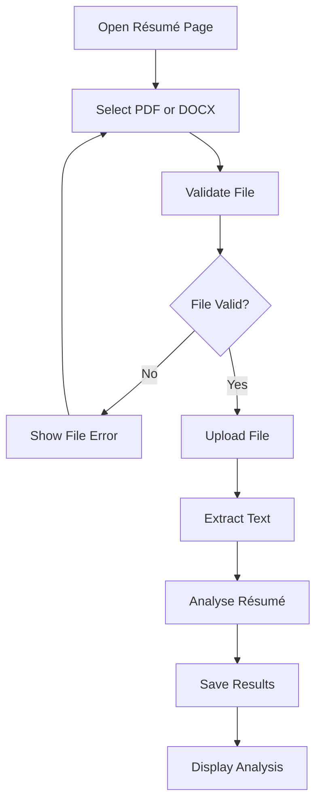

### File Validation

The system will check:

- File extension
- MIME type
- File size
- Empty files
- Unreadable files
- User ownership

### Résumé Analysis Results

The candidate will be able to view:

- Extracted skills
- Education
- Work experience
- Projects
- Certifications
- Missing résumé sections
- Improvement suggestions

---

## 9. Job-Matching Flow

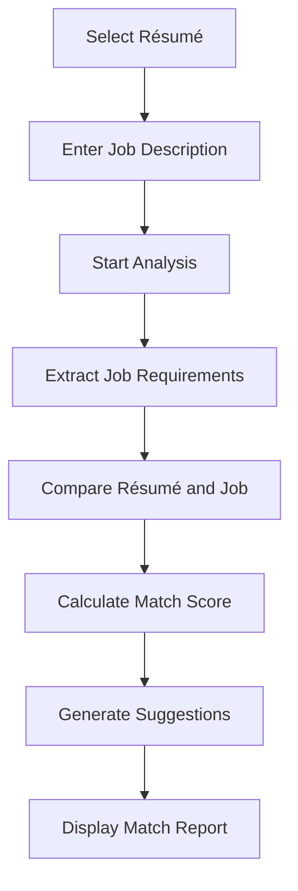

### Job-Match Report

The report will display:

- Overall match score
- Matched skills
- Missing skills
- Partially matched skills
- Important keywords
- Experience alignment
- Résumé improvement suggestions

The candidate may continue directly from the job-match report to a personalized
mock interview.

---

## 10. Interview Configuration Flow

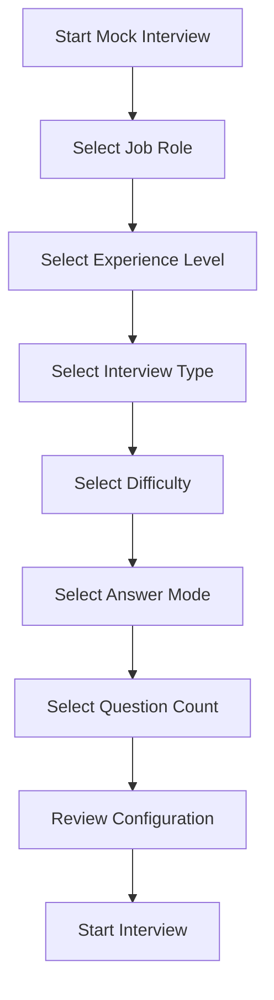

### Interview Options

The candidate can select:

- Target job role
- Beginner, intermediate, or experienced level
- Technical, HR, behavioural, or mixed interview
- Easy, medium, or difficult questions
- Text or voice answer mode
- Number of interview questions

A résumé and job description may also be selected to personalize the
questions.

---

## 11. Text Interview Flow

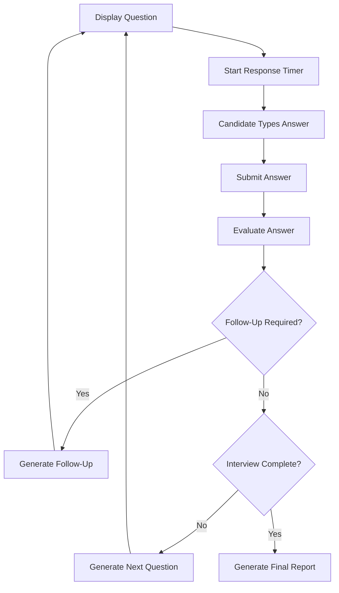

The candidate will answer one question at a time. The system will store the
question, answer, response time, and evaluation.

---

## 12. Voice Interview Flow

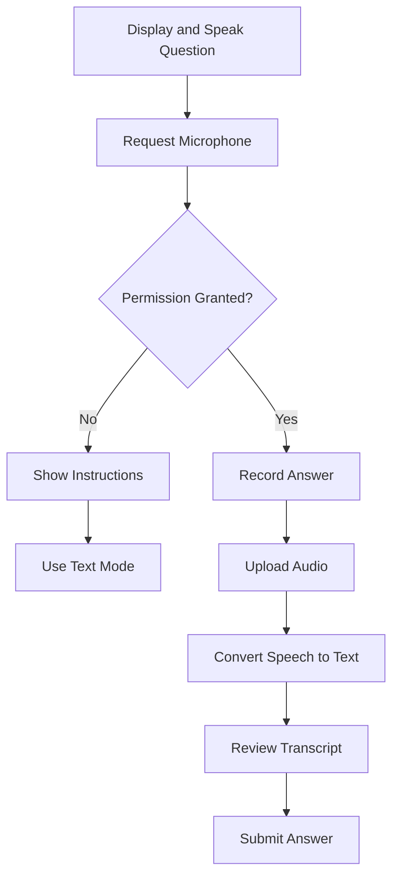

The candidate will be allowed to review the transcript before submitting it
for evaluation.

If voice recording or transcription fails, the candidate can retry or switch
to text mode.

---

## 13. Dynamic Follow-Up Flow

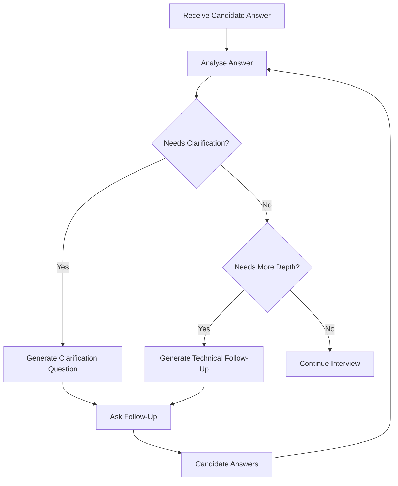

Follow-up questions may be generated when:

- The answer is incomplete
- The answer requires clarification
- The candidate mentions an important technology
- A technical concept needs deeper explanation
- The candidate provides an interesting project example

The system will limit follow-up questions so that the interview does not
continue indefinitely.

---

## 14. Answer-Evaluation Flow

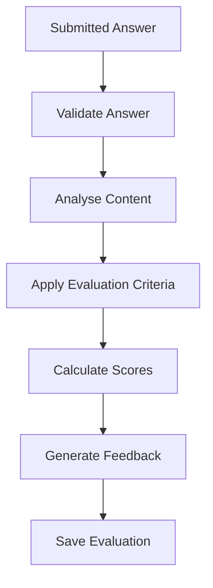

Each answer may be scored using:

- Technical correctness
- Answer relevance
- Communication quality
- Clarity
- Structure
- Completeness
- Use of examples
- Response time

The evaluation will not use protected personal characteristics.

---

## 15. Final Report Flow

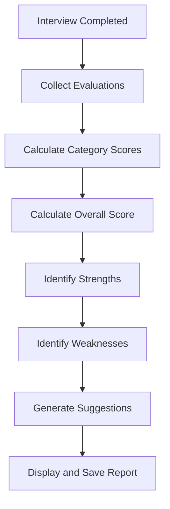

The final report will include:

- Technical-knowledge score
- Communication score
- Relevance score
- Answer-structure score
- Response-time score
- Overall score
- Candidate strengths
- Areas for improvement
- Question-level feedback
- Personalized practice suggestions

---

## 16. Dashboard Flow

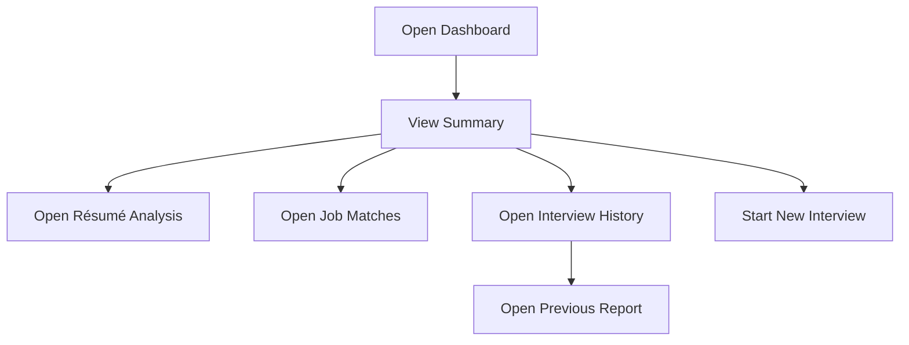

The dashboard will provide quick access to:

- Candidate profile
- Uploaded résumés
- Latest résumé analysis
- Saved job-match reports
- Recent interviews
- Performance history
- New mock interview
- Improvement suggestions

---

## 17. Interview History Flow

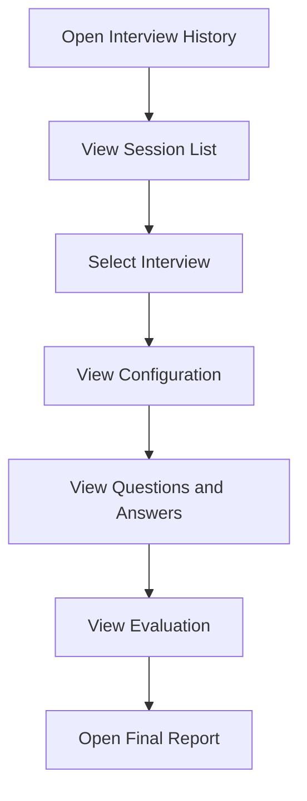

Candidates will only be able to access their own interview sessions and
reports.

---

## 18. Logout Flow

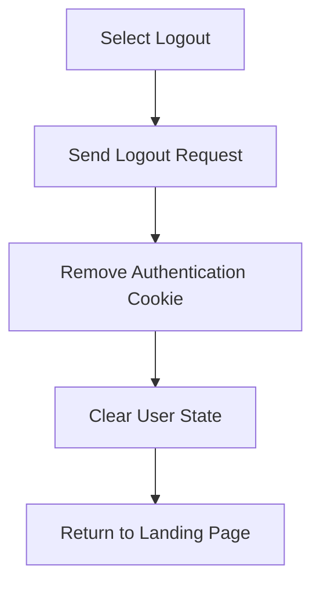

After logout, protected pages will redirect the user to the login page.

---

## 19. Protected Route Flow

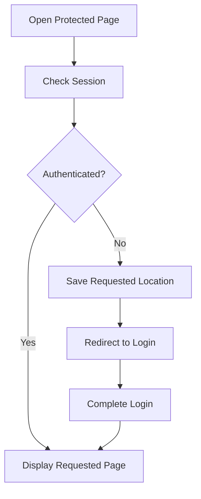

Protected pages will include:

- Dashboard
- Profile
- Résumés
- Job matches
- Interview sessions
- Performance reports
- History pages

---

## 20. Error and Recovery Flow

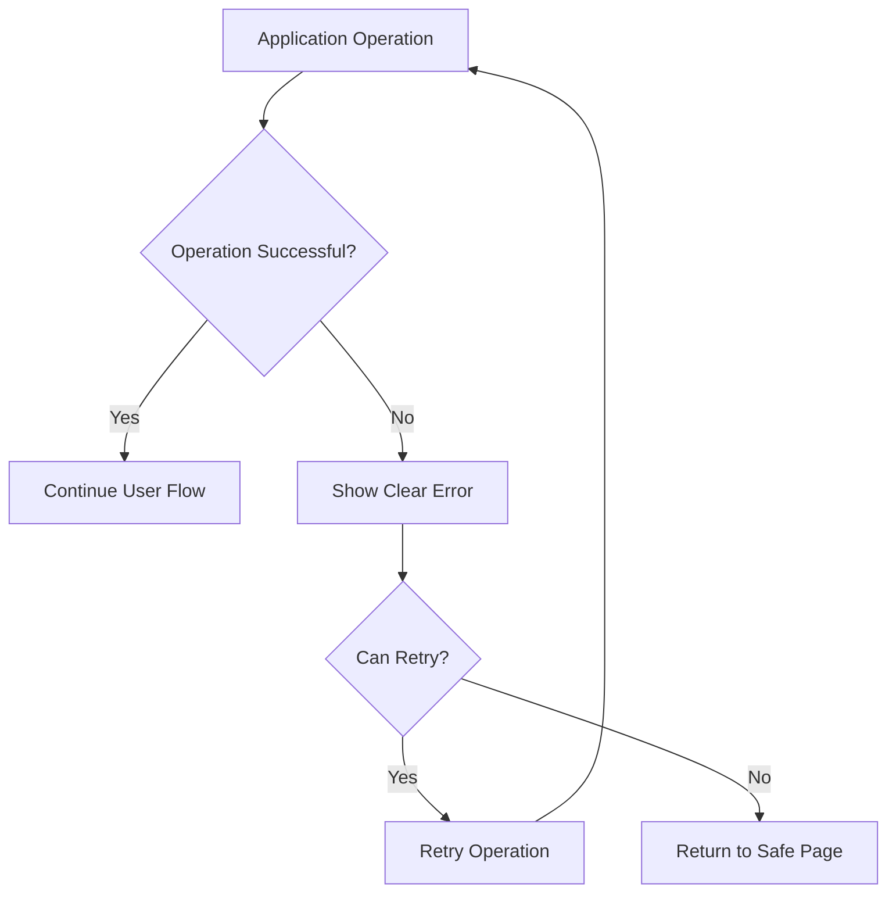

Examples include:

- Invalid login details
- Unsupported résumé files
- Failed file uploads
- Unreadable résumé text
- Microphone permission denied
- Speech-transcription failure
- AI-service failure
- Lost internet connection
- Expired authentication session
- Database or server error

The system will preserve completed work whenever possible.

---

## 21. Planned Application Routes

### Public Routes

| Route | Purpose |
|---|---|
| `/` | Landing page |
| `/login` | Candidate login |
| `/register` | Candidate registration |
| `/about` | Project information |
| `/privacy` | Privacy information |

### Protected Routes

| Route | Purpose |
|---|---|
| `/dashboard` | Candidate dashboard |
| `/profile` | Candidate profile |
| `/resumes` | Résumé management |
| `/resumes/:resumeId` | Résumé details |
| `/job-match` | Create job match |
| `/job-matches/:matchId` | Job-match report |
| `/interviews` | Interview history |
| `/interviews/new` | Interview configuration |
| `/interviews/:sessionId` | Active interview |
| `/reports/:reportId` | Performance report |

A final not-found route will handle invalid URLs.

---

## 22. Complete User Journey Summary

```text
Open CareerSaathi AI
        ↓
Register or Log In
        ↓
Complete Candidate Profile
        ↓
Upload and Analyse Résumé
        ↓
Enter Target Job Description
        ↓
View Match Score and Skill Gaps
        ↓
Configure Personalized Interview
        ↓
Answer through Text or Voice
        ↓
Receive Dynamic Follow-Up Questions
        ↓
Complete Interview
        ↓
View Performance Report
        ↓
Review Suggestions
        ↓
Practise Again and Track Progress
```

This flow allows CareerSaathi AI to support the candidate from résumé
preparation through interview practice and performance improvement.

---

© 2026 CareerSaathi AI Project Documentation